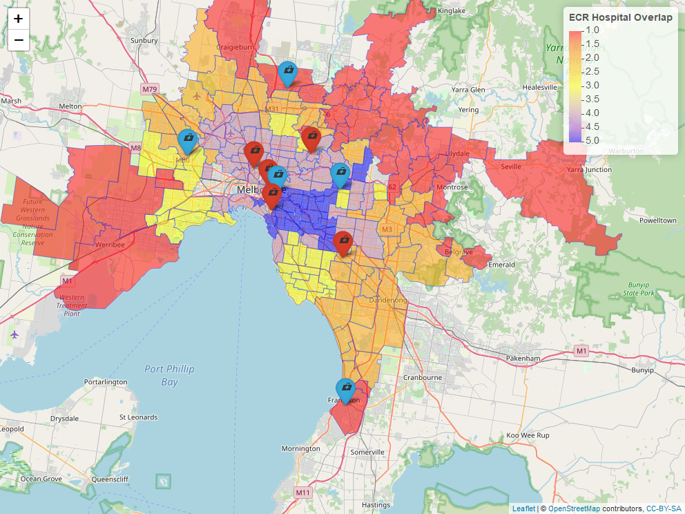
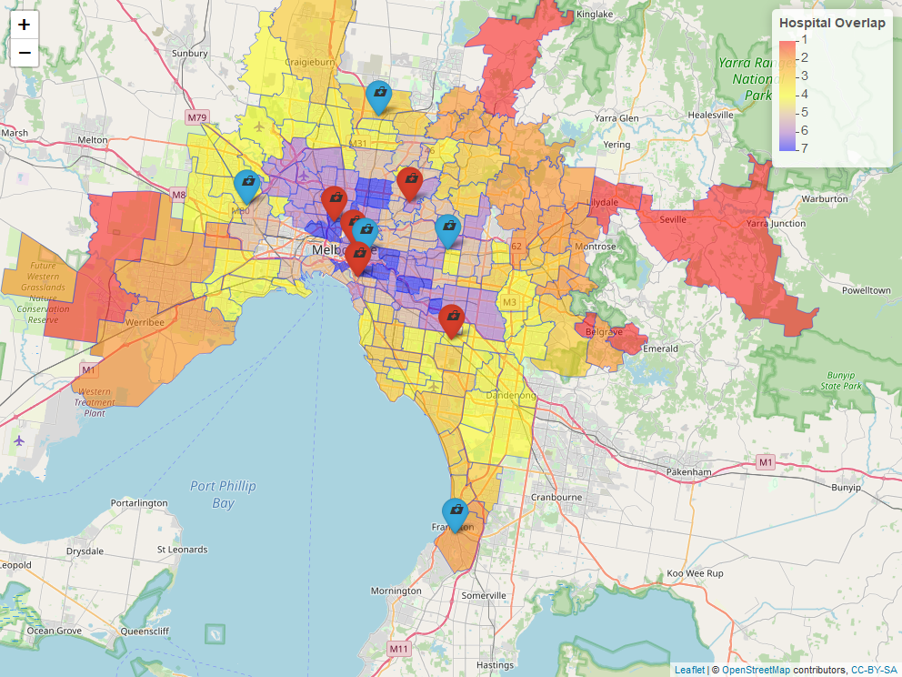

# MelbourneMaxCov
Recent advances in acute stroke therapy has placed focus on transportation of patients to the appropriate hospital for acute stroke therapy. Some hospitals are capable of providing clot busting drug TPA only and selected hospitals are capable of providing clot busting drug TPA as well as clot extraction (ECR).Development of an equitable stroke service needs to optimize for hospital catchments and population at risk. The aim of this project is to perform a redundancy analysis by searching locations in Melbourne in which there are oversupply of stroke services. 

Travel time from the centroids of each suburbs to the (2 ECR designated hubs (ECR-Hub), 3 ECR capable (ECR-Capable) and 5 thrombolysis) hospitals is estimated using ggmap package in R to interface with Google Maps application program interface (API). This step can also be done with googleway package. The term ECR-hub is used here is also synonymous with the term Comprehensive Stroke Centre (CSC). Suburbs were assigned membership of a hospital if it is within 30 minutes. Next, we sequentially remove thrombolysis capable hospitals and examine the effect on service catchment. The population serviceable by each hospital was estimated using stroke incidence studies in Melbourne. 

The majority of suburbs (141 of 174 or 81.0%) are within 30 minutes catchment of at two or more ECR hubs and 96.6% (168/174) are within 30 minutes of all ECR hubs or thrombolysis capable hospitals. The median coverage by ECR hub is 3 (IQR 2, 4) [click here](./ECR.png) and ECR or thrombolysis is 4 (IQR 3 , 6) [click here](./TPAanECR.png). These suburbs are located within inner east Melbourne and are displayed below [](./MelbourneECR.html).

The picture is the same when both TPA and ECR hospitals are considered together [](./MelbourneTPA.html)

Removing the thrombolysis capable hospitals in Melbourne only reduced the number of suburbs with redundant (≥2 hospital) coverage by 15.6%.

Leaflet use a standard blue pin. The different icons were created using the awesomeIcons.

```R
#icon markers-function to choose color tpa vs ECR
getColor <- function(tpa) {
 sapply(TPA$ECR, function(ECR) {
  if(ECR == 1 ) {
   "red"
  } else {
   "blue"
  } })
}

icons <- awesomeIcons(
  #icon = 'ios-close',
  icon= 'medkit',
  iconColor = 'black',
  library = 'ion',
  markerColor = getColor(TPA)
)

#color by maxcov
    pal <- colorNumeric(
    palette = c("red","yellow","blue"),
    domain = poa$maxcov)
```
A related project that is under development is the ground versus air transport in the state of Victoria. The map contains location of air transport and hospitals. It is available at https://gntem3.shinyapps.io/heliecr/

```R
#create helicopter icon
#save picture of helicopter in directory
HIcon<-iconList(
  HeliIcon<-makeIcon("heli.png",
                     iconWidth = 26,iconHeight = 26),
  RMHfront<-makeIcon("rmhfront.png",
                     iconWidth = 26,iconHeight = 26),
  MMCfront<-makeIcon("mmcfront.png",
                   iconWidth = 26,iconHeight = 26)
)
  
```

```R
#location of air transport using ggmap 
#can also be done without key with geocode_OS from tmaptools
#geocode("essendon fields airport, victoria")
#144.9015 -37.72641
#geocode("warnambool airport, victoria")
#142.4497 -38.29997
#geocode("bendigo airport, victoria")
#144.3264 -36.73832
#geocode("latrobe valley airport, victoria")
#146.4711 -38.20847
```

This next section describes how I make changes within Rstudio and commits the changes to github. There's more work here than direct uploading in github. This step was done to avoid issues with differences in line errors.

```git 
#create a project in Rstudio
#after modifying files type on Git Bash
 git add README.md
#Alternately click Staged under Git
 git commit -m "changes for README.md"
#Alternately click Commit and add a message "changes for README.md"
git push -u origin master
```